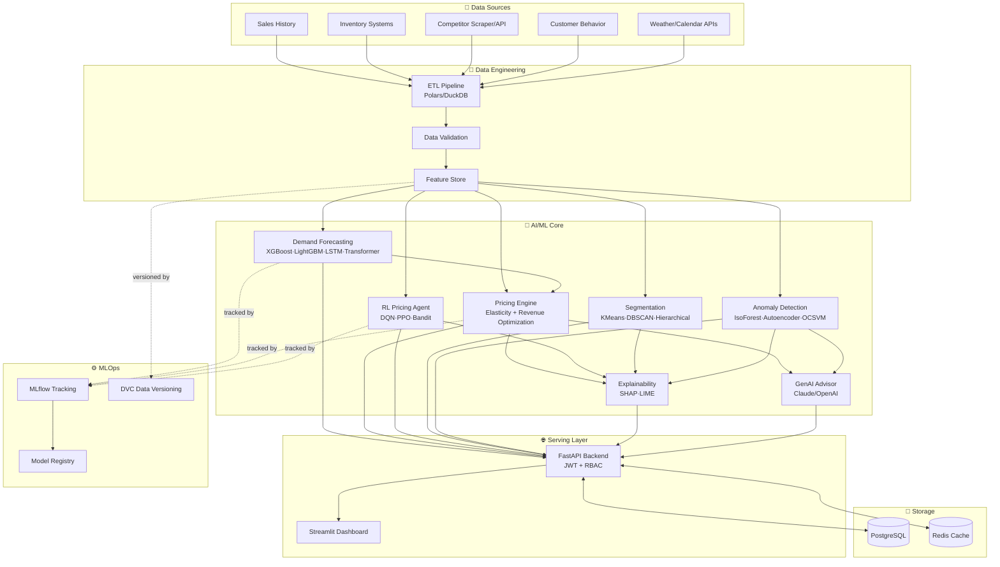
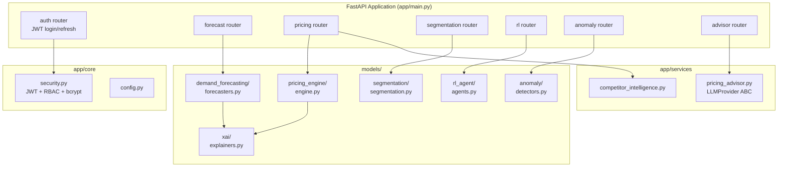
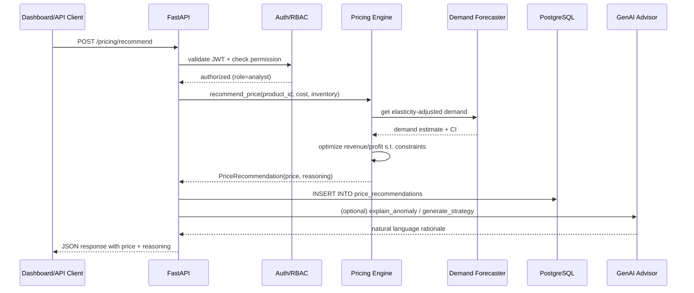
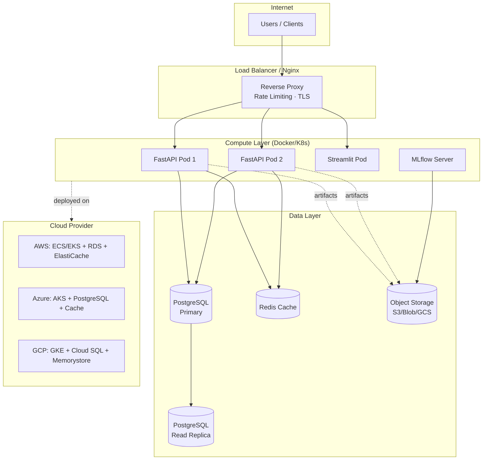
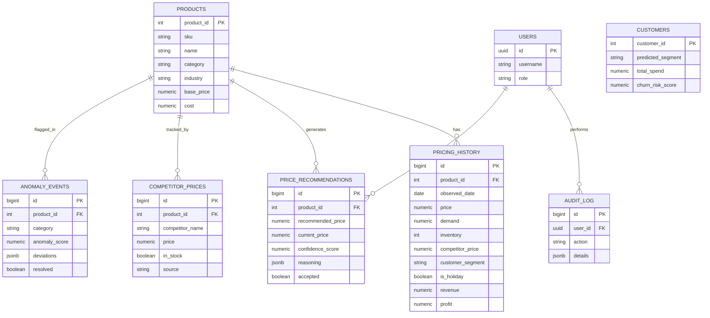

# System Architecture

<p align="center"></p>

## Table of Contents
- [High-Level Architecture](#high-level-architecture)
- [Low-Level Component Architecture](#low-level-component-architecture)
- [Data Flow Diagram](#data-flow-diagram)
- [ML Pipeline Diagram](#ml-pipeline-diagram)
- [Deployment Architecture](#deployment-architecture)
- [Database ER Diagram](#database-er-diagram)

---

## High-Level Architecture



---

## Low-Level Component Architecture



---

## Data Flow Diagram



---

## ML Pipeline Diagram

```mermaid
graph LR
    Raw[("Raw Data<br/>(data/raw)")] --> Clean[Data Cleaning<br/>& Validation]
    Clean --> Feat[Feature Engineering<br/>(data/features)]
    Feat --> Split[Train/Val/Test Split]

    Split --> GBM[Gradient Boosting<br/>XGB/LGBM/CatBoost]
    Split --> Seq[Sequence Models<br/>LSTM/GRU/Transformer]
    Split --> Prophet[Prophet<br/>Seasonal Decomposition]

    GBM & Seq & Prophet --> Ensemble[Model Comparison<br/>& Selection]
    Ensemble --> Elasticity[Elasticity Estimation]
    Elasticity --> Optimize[Revenue/Profit<br/>Optimization]
    Optimize --> RLEnv[RL Environment<br/>Simulation]
    RLEnv --> RLTrain[DQN/PPO/Bandit<br/>Training]
    RLTrain --> Eval[Policy Evaluation<br/>vs Baseline]
    Eval --> Registry[(MLflow Model<br/>Registry)]
    Registry --> Deploy[Production API]
```

---

## Deployment Architecture



---

## Database ER Diagram



---

## Technology Stack Summary

| Layer | Technologies |
|-------|--------------|
| **Forecasting** | XGBoost, LightGBM, CatBoost, Prophet, PyTorch (LSTM/GRU/Transformer) |
| **Pricing** | scipy.optimize, scikit-learn (elasticity regression) |
| **RL** | Custom DQN/PPO (PyTorch), Multi-Armed Bandit (Thompson Sampling/UCB1) |
| **Segmentation** | scikit-learn (KMeans, DBSCAN, Agglomerative) |
| **Anomaly Detection** | scikit-learn (IsolationForest, OneClassSVM), PyTorch Autoencoder |
| **Explainability** | SHAP, LIME |
| **GenAI** | Anthropic Claude / OpenAI GPT (provider abstraction) |
| **API** | FastAPI, JWT (python-jose), bcrypt (passlib), slowapi (rate limiting) |
| **Dashboard** | Streamlit, Plotly |
| **Database** | PostgreSQL, Redis |
| **MLOps** | MLflow, DVC, Optuna |
| **Data Engineering** | Pandas, Polars, DuckDB |
| **Deployment** | Docker, Docker Compose, Kubernetes, AWS/Azure/GCP |
| **CI/CD** | GitHub Actions |
