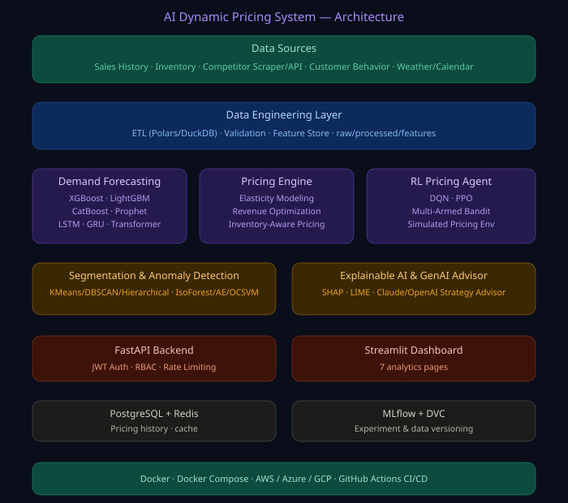

<div align="center">



# 💹 AI-Powered Dynamic Pricing Optimization System

### *Enterprise-grade revenue optimization: demand forecasting, RL pricing agents, competitor intelligence, and explainable AI in one platform*

[](https://python.org)
[](https://pytorch.org)
[](https://fastapi.tiangolo.com)
[](https://postgresql.org)
[](https://mlflow.org)
[](https://docker.com)
[](LICENSE)

[](tests/test_suite.py)
[](https://github.com/psf/black)

**A complete pricing intelligence platform** combining 7 demand-forecasting backends, elasticity-based revenue optimization, 3 reinforcement-learning pricing paradigms, customer segmentation, anomaly detection, explainable AI, and a generative AI advisor — built to run any business's pricing strategy from day one.

[🏗️ Architecture](ARCHITECTURE.md) · [📊 Datasets](DATASETS.md) · [🚀 Quick Start](#-quick-start) · [🗺️ Roadmap](ROADMAP.md) · [🤝 Contributing](CONTRIBUTING.md)

</div>

---

## ✨ Why This Project?

| Capability | Typical Pricing Tool | **This System** |
|-------------|----------------------|------------------|
| Demand Forecasting | 1 model (usually ARIMA) | **7 models**: XGBoost, LightGBM, CatBoost, Prophet, LSTM, GRU, Transformer |
| Pricing Logic | Static rules | **Elasticity-estimated revenue/profit optimization** with inventory & segment awareness |
| Sequential Decisions | None | **3 RL paradigms**: DQN, PPO, Multi-Armed Bandit, in a custom simulated environment |
| Customer Intelligence | Basic RFM | **3 clustering algorithms** with auto-mapped business segment labels |
| Anomaly Detection | None | **Ensemble of 3 models** with majority voting + business categorization |
| Explainability | None | **SHAP + LIME** on pricing/demand drivers |
| Competitor Intelligence | Manual | **Pluggable scraper/API/mock architecture** |
| AI Advisor | None | **Claude/OpenAI-powered** strategy generation & executive summaries |
| Security | Basic | **JWT + RBAC + rate limiting + bcrypt** |
| Industries Supported | 1 | **10**: e-commerce, retail, grocery, airline, hotel, railway, rideshare, food delivery, SaaS, cloud computing |

---

## 🎯 Core Modules

```
Data → Forecast → Price → (RL refine) → Explain → Advise → Serve
```

### 1️⃣ Demand Forecasting Engine
`models/demand_forecasting/forecasters.py`
- **Gradient Boosting:** XGBoost, LightGBM, CatBoost with 30+ engineered lag/rolling/calendar features
- **Time Series:** Prophet (seasonal decomposition)
- **Deep Learning:** LSTM, GRU, Transformer (custom PyTorch implementations with positional encoding)
- Outputs: point forecast + 80%/95% confidence intervals + feature importance

### 2️⃣ Dynamic Pricing Engine
`models/pricing_engine/engine.py`
- Log-log price elasticity estimation per product
- Revenue/profit optimization via `scipy.optimize` subject to margin/markup/discount bounds
- Inventory-aware adjustment (accelerate sell-through or manage scarcity)
- Customer-segment and competitor-aware price capping
- Full explainable reasoning trail per recommendation

### 3️⃣ Reinforcement Learning Pricing Agent
`models/rl_agent/agents.py`
- **DQN** with experience replay + target network
- **PPO** with GAE and clipped surrogate objective (custom actor-critic)
- **Multi-Armed Bandit**: Thompson Sampling, UCB1, ε-greedy
- Custom `PricingEnvironment` simulating demand response, inventory depletion, and customer retention dynamics
- `PolicyEvaluator` benchmarks trained agents against fixed-price baselines

### 4️⃣ Customer Segmentation
`models/segmentation/segmentation.py`
- K-Means, DBSCAN, Hierarchical (Agglomerative) clustering
- Automatic business-label assignment: Premium, Budget, High-Frequency, Seasonal, Price-Sensitive
- Silhouette + Calinski-Harabasz scoring for algorithm comparison

### 5️⃣ Anomaly Detection
`models/anomaly/detectors.py`
- Isolation Forest, Autoencoder (PyTorch), One-Class SVM
- Ensemble majority-voting for robust flagging
- Business categorization: price manipulation, demand spikes, fraud patterns, inventory anomalies

### 6️⃣ Explainable AI
`models/xai/explainers.py`
- SHAP (Tree/Kernel explainers) for pricing/demand model drivers
- LIME for local, model-agnostic explanations
- Z-score deviation explainer for fast anomaly narratives

### 7️⃣ Competitor Intelligence
`app/services/competitor_intelligence.py`
- Pluggable `CompetitorDataSource` ABC: `MockCompetitorDataSource` (default), `WebScraperDataSource` (BeautifulSoup), `APIFeedDataSource`
- Market positioning rank + trend analysis

### 8️⃣ Generative AI Pricing Advisor
`app/services/pricing_advisor.py`
- Provider-agnostic (`AnthropicProvider` / `OpenAIProvider`)
- Pricing strategy generation, executive summaries, anomaly explanations
- Graceful rule-based fallback when no API key is configured — **never hardcodes keys**

---

## 🚀 Quick Start

### Docker (Recommended)
```bash
git clone https://github.com/your-username/ai-dynamic-pricing.git
cd ai-dynamic-pricing
cp .env.example .env   # edit secrets
python scripts/generate_datasets.py
docker compose up -d
```

| Service | URL |
|---------|-----|
| Dashboard | http://localhost:8501 |
| API Docs | http://localhost:8000/docs |
| MLflow | http://localhost:5000 |

### Local Python
```bash
python -m venv .venv && source .venv/bin/activate
pip install -r requirements.txt
python scripts/generate_datasets.py --pricing-rows 100000 --customer-rows 50000 --competitor-rows 50000
uvicorn app.main:app --reload &
streamlit run frontend/dashboard.py
```

**Demo login:** `admin` / `admin123` (analyst: `analyst` / `analyst123`) — **change before production use.**

---

## 🔌 API Reference

```bash
POST /api/v1/auth/login              # JWT login
GET  /api/v1/auth/me                 # current user info

POST /api/v1/datasets/upload         # upload custom pricing/customer CSV
GET  /api/v1/datasets                # list loaded datasets

POST /api/v1/forecast                # run demand forecasting (multi-backend)
POST /api/v1/pricing/fit             # fit elasticity models
POST /api/v1/pricing/recommend       # get price recommendation

POST /api/v1/segmentation/run        # run customer clustering
POST /api/v1/rl/train                # train DQN/PPO/Bandit pricing agent
POST /api/v1/anomaly/detect          # ensemble anomaly detection

POST /api/v1/advisor/ask             # ask the GenAI pricing advisor
```
Full interactive docs: `http://localhost:8000/docs`

### Example: Get a Price Recommendation
```python
import httpx

token = httpx.post("http://localhost:8000/api/v1/auth/login",
    data={"username": "admin", "password": "admin123"}).json()["access_token"]

httpx.post("http://localhost:8000/api/v1/pricing/fit",
    headers={"Authorization": f"Bearer {token}"})

rec = httpx.post("http://localhost:8000/api/v1/pricing/recommend",
    json={"product_id": 1, "cost": 60.0, "inventory": 200, "customer_segment": "premium"},
    headers={"Authorization": f"Bearer {token}"}).json()

print(rec["recommended_price"], rec["reasoning"])
```

---

## 🧪 Testing

```bash
pytest tests/test_suite.py -v --cov=app --cov=models --cov-report=html
```
**41 tests** covering demand forecasting, pricing engine, RL agents, segmentation, anomaly detection, competitor intelligence, explainability, and full API integration (auth + RBAC).

---

## 🏗️ Architecture

See [ARCHITECTURE.md](ARCHITECTURE.md) for full Mermaid diagrams: high-level system, low-level components, data flow, ML pipeline, deployment, and database ER diagram.

```
ai-dynamic-pricing/
├── app/
│   ├── main.py              # FastAPI application
│   ├── core/security.py     # JWT + RBAC
│   └── services/            # competitor_intelligence.py, pricing_advisor.py
├── models/
│   ├── demand_forecasting/  # XGBoost/LightGBM/CatBoost/Prophet/LSTM/GRU/Transformer
│   ├── pricing_engine/      # elasticity + revenue optimization
│   ├── rl_agent/            # DQN/PPO/Bandit + simulated environment
│   ├── segmentation/        # KMeans/DBSCAN/Hierarchical
│   ├── anomaly/             # IsolationForest/Autoencoder/OCSVM
│   └── xai/                 # SHAP/LIME explainers
├── frontend/dashboard.py    # Streamlit (7 dashboard pages)
├── data/synthetic/          # generated datasets (100K+/50K+/50K+ rows)
├── migrations/              # PostgreSQL schema + runner
├── tests/test_suite.py      # 41 tests
├── docker/, docker-compose.yml
└── .github/workflows/ci.yml
```

---

## 🌍 Supported Industries

E-Commerce · Retail · Grocery · Airline · Hotel · Railway · Ride-Sharing · Food Delivery · SaaS Subscription · Cloud Computing Resource Pricing

---

## 🤝 Contributing

See [CONTRIBUTING.md](CONTRIBUTING.md). We welcome new forecasting models, RL algorithms, datasets, and dashboard pages.

## 📜 License

[MIT License](LICENSE) — free for commercial and personal use.

---

<div align="center">

**Built for businesses that want pricing decisions backed by data, not guesswork.**

[⭐ Star this repo](https://github.com) · [🐛 Report Bug](https://github.com) · [💡 Request Feature](https://github.com)

</div>
